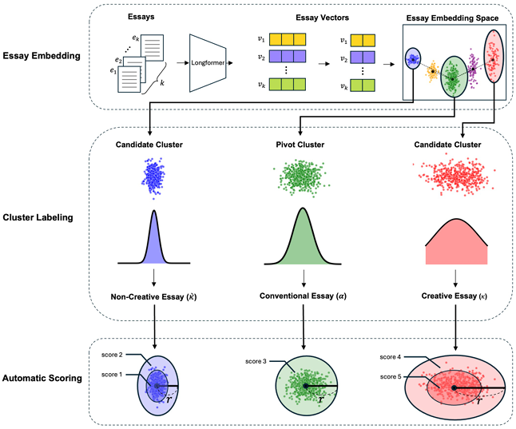

# Representation-to-Creativity

📑 [**Representation-to-Creativity (R2C): Automated Holistic Scoring Model for Essay Creativity**](https://aclanthology.org/2025.findings-naacl.292.pdf)

## Introduction

we propose a novel **self-supervised learning model** that recognizes cluster patterns within the essay embedding space and leverages them for creativity scoring. This approach aims to automatically generate a **high-quality training set**, thereby facilitating the training of diverse language models.

