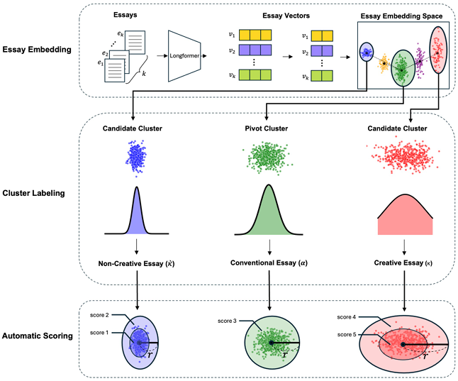

# Representation-to-Creativity

📑 [**Representation-to-Creativity (R2C): Automated Holistic Scoring Model for Essay Creativity**](https://aclanthology.org/2025.findings-naacl.292.pdf)

## Introduction

we propose a novel **self-supervised learning model** that recognizes cluster patterns within the essay embedding space and leverages them for creativity scoring. This approach aims to automatically generate a **high-quality training set**, thereby facilitating the training of diverse language models.



# 🛠️ Installation
```bash
git https://github.com/Deok-gi/Representation-to-Creativity.git
cd Representation-to-Creativity

conda create -n r2c python=3.7.16
conda activate r2c

pip install -r requirements.txt
```

# 💻 Usage
### 1. Essay-to-Vector (E2V)
```bash
cd src
python3 essay-to-vector.py
```
- The D1, D2, and D3 datasets presented in the paper are provided in the "datasets" folder.
- The model used in the code is as follows: https://huggingface.co/Deok-gi/longformer-bert-base-4096 (We recommend downloading the model locally.)
- Running the code will save the essay vectors as .pt files.